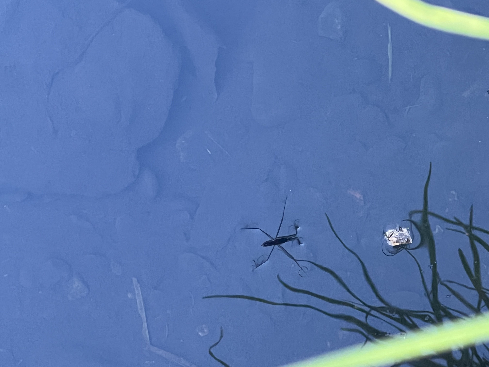

# StrawberryWatch: Strawberry Creek Monitoring Group Anomaly Detection System

<p align="center">
  
</p>

This is a Modular anomaly detection system for the Strawberry Creek urban watershed.

The currently depoloyed model, Dusk Crayfish, learns the creek's normal behavior from sensor data and flags deviations that look like spills or contamination events, without being trained on labeled anomalies. It treats the creek as a connected graph of sensor sites and combines a graph neural network with an Long Short Term Memory architecture to reason about both where a sensor sits in the flow and how its readings change over time.

This repository is the research and development counterpart to the production monitoring platform. It is where models are built, tested against historical events, and validated before anything is trusted for live alerting.

## Models

<table align="center">
  <tr>
    <td align="center"><b>Dusk Crayfish</b></td>
    <td align="center"><b>Water Strider</b></td>
    <td align="center"><b>Flame Skimmer</b></td>
  </tr>
  <tr>
    <td align="center" width="33%">The deployed model. A graph convolutional network learns the relationships between sensor sites across the creek, and a long short-term memory network learns how each site's readings change over time. Together they predict what normal looks like, and large prediction errors are flagged as anomalies.</td>
    <td align="center" width="33%">A transformer-based model that uses attention to weigh how different points in time relate to each other. Still in development, not yet deployed.</td>
    <td align="center" width="33%">A model that estimates how confident it is by running predictions many times with random parts of the network switched off, then measuring how much the answers vary. Still in development, not yet deployed.</td>
  </tr>
  <tr>
    <td align="center"></td>
    <td align="center"></td>
    <td align="center"></td>
  </tr>
   <tr>
    <td align="center"><b>Berry Delight</b></td>
    <td></td>
    <td></td>
  </tr>
  <tr>
    <td align="center" width="33%">TBD</td>
    <td></td>
    <td></td>
  </tr>
  <tr>
    <td align="center"></td>
    <td></td>
    <td></td>
  </tr>
</table>

## What the deployed Model does

The creek is monitored at eleven locations: UC Botanical Gardens, Women's Faculty Club (south fork 0), Stephens Hall (south fork 1), Downstream of Sather Gate (south fork 2), Weil Hall (south fork 3), Kingman Hall Garden, University House, Giannini Hall (north fork 0), Wickson Footbridge (north fork 1, also sometimes labeled as scnf010), and Codornices Creek. The eleventh site, Codornices, is a separate watershed monitored as a standalone point and deliberately left out of the flow graph.

The map below shows these sensors on the actual creek, with each fork tracing the real water flow down to the Oxford Street confluence.

<p align="center">
  
</p>

<p align="center"><i>The physical sensor network along Strawberry Creek, overlaid on the creek's real flow. Both forks converge at the Oxford Street confluence. This is the full field deployment, not the modeled graph: four of these sites are modeled, north_fork_0, south_fork_1, south_fork_2, and Oxford.</i></p>

To see the entire creek in more detail, you can view the map on the Strawberry Creek website. The same network, expressed as the directed flow graph the system reasons over, looks like this.


<p align="center"><i>Full Graph Topology: Complete physical watershed sensor footprint of the Strawberry Creek monitoring network.</i></p>

The model is trained and validated on a four-node core of this network, the main flow path where conductivity data is reliable. That active subgraph is shown below, with the remaining sites slated to be brought in as their data ingestion is completed. The north path runs straight from north_fork_0 to Oxford because the footbridge node between them was retired; the water still flows that way, there is just no sensor reporting in between.


<p align="center"><i>Dusk Crayfish Active Graph Topology: the 4-node subnetwork the model actually trains and serves on.</i></p>

The system pulls sensor readings, merges in weather, learns what normal looks like across the whole network, and then scores new data by how badly the model fails to predict it. A large, sustained prediction error on conductivity that shows up across connected sites is the signature of a real event.

The model is unsupervised. It is trained only to predict the next reading from recent history. Anything it cannot predict well is, by definition, something it has not seen before, which is what an anomaly is.

## Setup

Clone the repository and create a virtual environment using Python 3.12, then install dependencies.

```bash
python -m venv .venv
source .venv/bin/activate
pip install -r requirements.txt
```

The system needs environment variables for data and weather access. Copy `.env.example` to `.env` in the repository root and fill in what applies to your setup.

```
# Public API (the token field is optional; the API currently requires no auth)
SCMG_API_TOKEN=
SCMG_API_BASE_URL=https://www.strawberrycreek.org/api/creek-data/

# NWS weather station -- no API key required, but NWS requires a contact email
# in the User-Agent string
NWS_STATION_ID=LBNL1
NWS_USER_AGENT=SCMG-AnDeSys/1.0 (your.email@example.com)
USE_NWS_WEATHER=true

# MySQL -- only needed with --data-source sql
MYSQL_HOST=
MYSQL_DATABASE_USER=
MYSQL_DATABASE_PASSWORD=
MYSQL_DATABASE_NAME=
MYSQL_PORT=3306

# Email alerts -- only needed if you want spill notifications
ALERT_EMAIL_SENDER=your_email@gmail.com
ALERT_EMAIL_PASSWORD=your_app_password
ALERT_EMAIL_RECEIVER=who_to_notify@gmail.com
SMTP_SERVER=smtp.gmail.com
SMTP_PORT=587

# How many days of data to keep in the rolling local cache
ROLLING_WINDOW_DAYS=90
```

The MySQL variables are only needed if you run with `--data-source sql`. Weather from NWS and Open-Meteo needs no key, but the NWS user-agent string must include a contact email per NWS requirements.

One network note. The Open-Meteo historical archive must be reachable for long-window weather fetches. If your machine restricts outbound traffic, the host `archive-api.open-meteo.com` needs to be allowed, or the pipeline will fall back to running without weather features.

## How to use Dusk Crayfish

The main entry point is `main.py`. It has three modes.

**Train** builds a fresh model on thirty days of data, computes a detection threshold from a validation split, and saves the weights and metadata.

```bash
python main.py --mode train --data-source api
```

**Inference** loads the saved model, pulls a short recent window (two days), and reports any anomalies. It falls back to training if no saved model exists.

```bash
python main.py --mode inference --data-source api
```

**Update** retrains on a fresh thirty-day window while reusing the existing setup, for keeping the model current as new data arrives. This is the default mode when `--mode` is not specified.

```bash
python main.py --mode update --data-source api
```

The `--data-source` flag chooses between the public API, which provides the three core sensor features, and the production SQL database, which provides more. The `--model` flag selects the architecture, defaulting to the validated one.

```bash
python main.py --mode train --data-source sql --model dusk_crayfish
```

Adding `--visualize` after any run produces a static dashboard and an interactive plot of the scores, thresholds, and flagged events.

To start the continuous monitoring loop, run `scripts/run_live.py` directly. It blocks indefinitely, calling `main.py --mode inference` via subprocess every 15 minutes, and exits cleanly on Ctrl-C. It resolves `main.py` relative to its own location, so it can be launched from any directory.

```bash
python scripts/run_live.py
```

To validate the model against the labeled historical events, run the test suite. The `-s` flag shows the per-case diagnostic output, which is worth reading because each case prints its error curve and how many timesteps crossed the threshold.

```bash
pytest tests/test_anomaly_detection.py -v -s
```

## How each part works

**Loading and the rolling cache.** `data_loader.py` pulls a window of sensor data from the chosen source, renames the raw sensor columns to internal names, merges in weather, and writes the result to a rolling cache on disk. The cache is not just a speed trick. New fetches are merged with what is already there, deduplicated on time and location, and trimmed to a rolling window of recent days, so the cache becomes a usable working set rather than getting overwritten each run. When data comes from the API tier it carries three sensor features: conductivity, depth, and temperature. The SQL tier can carry more, and any extra columns flow through automatically as model features without code changes, because feature selection picks up every numeric column that is not on an exclude list.

**Weather merge.** Weather comes from one of two sources depending on the window. For windows up to about five days, near-term observations come from the NWS station. For longer windows, the historical archive from Open-Meteo is used. Both return the same column names so nothing downstream needs to know which ran. Rainfall gets special handling. The archive reports rain as an hourly total, but the creek samples every fifteen minutes, so each hourly total is divided across the four sub-hourly rows it covers. This keeps cumulative rainfall correct when it is summed over a window, which matters because the rain-aware detection logic reads exactly that windowed sum.

**Missing data.** `data_processor.py` handles the reality that sensors drop out. It sorts every reading into one of three classes. Permanently absent means a sensor at a site has no data at all in the window. Transiently absent means it has data sometimes but not at this timestep. Present means a real reading. Short gaps under about a day are filled by interpolating over time. Longer gaps are left missing. Everything still missing is filled with zero, but only after normalization, so zero means the neutral average rather than a literal zero that would skew the model.

**Normalization and sequencing.** The data is z-score normalized using statistics fit only on complete rows, then reshaped into a three-dimensional array of time by node by feature. A sliding window cuts this into sequences of twenty-four timesteps, six hours of history, each paired with the single next timestep as the prediction target. Only windows where every timestep is valid become training examples.

**The graph.** `graph_utils.py` builds the creek as a directed graph from the locations and edges defined in config. Config currently defines four nodes: `north_fork_0`, `south_fork_1`, `south_fork_2`, and `oxford`. The edges follow water flow downhill. On the north path, `north_fork_0` flows directly into `oxford`. On the south path, `south_fork_1` flows into `south_fork_2`, which flows into `oxford`. Oxford is the confluence of both paths. The north path used to run through a `footbridge` node, the Wickson Footbridge at the north fork 1 site; that node was removed because the API never served it, and its edge was contracted rather than cut, since the water still flows that way and only the sensor is missing. See Known limitations. Codornices is registered as a physical monitoring site in the field but has no node in this graph, because it is a separate watershed and connecting it would create spatial relationships that do not physically exist.

**The model.** `Dusk_Crayfish.py` defines `DuskCrayfish`, which reads its whole architecture from config. For each timestep in the window, a graph convolution lets each site's representation absorb information from its upstream and downstream neighbors, then the sites are averaged into a single creek-state summary for that moment. The twenty-four summaries form a sequence that an LSTM reads to capture the recent temporal trend. That trend is expanded back to every node and a linear layer predicts the next timestep for every feature at every site. The graph handles space, the LSTM handles time, and the prediction uses both.

The model also takes an optional `node_mask` marking which sites actually reported at each timestep, and two things change when it is passed. Feature propagation fills an offline node's features by diffusing its neighbors' real values across the graph before the convolution sees them, so a dark site between two reporting sites gets an estimate that sits between them rather than a zero. Masked pooling then averages only the nodes that have data, instead of dividing by the full node count and letting a placeholder zero drag the creek-state summary down. Without the mask the model behaves as though every node is present, which is what lets it train through the existing pipeline unchanged.

**Training.** `trainer.py` runs the training loop, minimizing mean squared error between predicted and actual next timesteps. On CPU it uses plain precision because mixed precision breaks the LSTM there. After training it computes the detection threshold as a high percentile of the validation conductivity errors, so the definition of anomalous is fixed at training time rather than recomputed on whatever is seen later. The feature list the model trained on is saved with the weights, which lets later runs reshape incoming data to match the model rather than rebuilding the model to match the data.

**Detection.** `anomaly_detector.py` scores each timestep and applies the threshold. Scoring follows a model-all, alert-one approach. The model predicts every feature, but only conductivity error counts toward the anomaly score, because conductivity is what actually responds to spills while other features add noise. The conductivity error is averaged across sites, so a deviation seen at several connected sensors scores higher than a single-site blip. On top of the base threshold, a rain-aware adjustment raises the bar during wet periods. For each timestep it sums rain over the preceding twelve hours, and if that exceeds a small amount it doubles the threshold there, so ordinary rain-driven conductivity changes do not trigger false alarms.

**Spill-type classification.** `metrics.py` is a rule-based classifier that is written and tested but not yet wired into the live path. A production run detects and alerts without calling it, and `notifier.send_spill_alert` accepts a classification only as an optional argument that `main.py` never passes. What follows describes what it does when called directly, which is how it is currently exercised. For each flagged event, it compares how water parameters moved during the event against a signature table of five known pollutant types: rain, tapwater, oil, sewage, and fertilizer. Movement direction for each parameter is measured against the twenty-four-hour baseline immediately before the event, and each pollutant type is scored by how many of its signature directions agree with what was observed. The classifier returns one of three verdicts: a named type when the evidence clearly separates candidates, undetermined when there is not enough discriminating data to name one honestly, or possible new type when the event is judgeable but matches no known signature well. Committing to a named type requires at least one discriminating channel to be populated: dissolved oxygen, pH, or floating conductivity. Conductivity and temperature alone collapse most types together, so the classifier declines to diagnose on those channels rather than guess. The Atlas sensors that carry those discriminating measurements are not yet reporting, so the classifier returns undetermined on every real event it has been run against. Wiring it into the alert path is waiting on those sensors, since until then it would add nothing to an alert.

**The other models.** `Flame_Skimmer.py` and `Water_Strider.py` are works in progress and not yet wired into the model registry, so they cannot yet be selected with the `--model` flag. `Flame_Skimmer` uses the same spatial backbone as `DuskCrayfish` but adds Monte Carlo Dropout for uncertainty estimation: at inference time, dropout stays active and predictions are sampled thirty times, producing a mean and a standard deviation. The anomaly detector can then ask how far an observation falls from the predicted distribution rather than just from a point prediction. `Water_Strider` replaces the LSTM with a Transformer encoder and sinusoidal positional encoding. It is designed for scenarios with months to years of training data, where Transformers can exploit longer-range temporal dependencies that an LSTM would miss. Both are intended to slot into the registry in `main.py` once finished, selectable with the `--model` flag exactly like the current model, with nothing else in the pipeline changing.


## Testing and validation

The model is validated against a catalog of real documented events in the tests directory, including south fork spills, overnight south fork events, foam events, a fire hydrant spill, a botanical garden actuator malfunction, sprinkler events, and several rainfall events that should not be flagged. Each test runs a labeled window through the model and checks whether the conductivity error crosses the trained threshold, using the same rain-aware logic the live pipeline uses. Cases too short to build valid sequences are skipped rather than failed. The suite is the main guard against a change quietly breaking detection.

## Known limitations

**Four nodes, not five.** The model covers north_fork_0, south_fork_1, south_fork_2, and oxford. Footbridge used to be a fifth graph node and was removed. The reason is worth stating plainly: the REST API never served footbridge, so it was absent from every live inference run, while the training corpus carried it as present at 100% of timesteps because gap imputation filled 96% of it in. The model therefore trained on a footbridge signal that production never provides, and fed that signal into oxford, its downstream neighbor. Footbridge alone accounted for 80,973 of the corpus's 97,329 imputed values. Dropping it and retraining cut the forecast error at the three remaining upstream nodes on the live path by up to 45%. If footbridge comes back online as a real reporting sensor, it can be re-added, but it has to be re-added as data rather than as interpolation.

**Oxford does not beat persistence, and this is structural.** Oxford scores -23.9 skill vs persistence on the held-out split and -105 on the live cache, and the four-node retrain made both worse rather than better. It is not deployable. The cause is not the graph or the roster: oxford is simply the most stable node on the network, moving 0.42 µS/cm between consecutive 15-minute readings against 1.6 to 3.2 for every other node, with a third of their overall variance. Persistence is close to unbeatable at a site that quiet, and skill vs persistence divides by that near-zero baseline error, so a prediction that is good in absolute terms still scores badly. Oxford was previously suspected of being poisoned by footbridge; the retrain tested that and disproved it. Skill vs persistence is close to the wrong instrument for this node, and an appropriate metric for it has not been chosen yet.

**Rule 1 is weak in the dry season.** Thresholds are calibrated on a held-out window that sits in the late wet season, and are then applied to a live cache that is 90% dry-season data past the end of the corpus. Persistence is five to six times more accurate in July than in January on the same sensor, so the dry season is a harder regime, not an easier one, and every node posts negative live skill there. A threshold tuned to wet-season residual spread is loose against a quiet summer series, which suppresses genuine small events. The live and offline numbers in this project are not directly comparable for this reason, and any comparison has to be run on a common window.

**No seasonal awareness.** Data from an out-of-season period reads as mildly anomalous everywhere. The corpus starts June 2025, so the held-out spring window is the only spring the model has ever seen, in either split, and a single chronological split cannot separate overfitting from never-having-seen-this-season.

**Detection is capped by rule structure, not by forecast quality.** Flagging requires at least 3 timesteps over threshold in a window. A step or spike injection produces only 1 to 2 elevated timesteps regardless of magnitude, because the model predicts one step ahead and absorbs the new level as soon as it enters its own input history. Confirmed up to 2000 µS/cm, four times the entire conductivity scale. Clean instantaneous jumps therefore mostly go undetected; sustained ramps are caught. False positive rates on clean windows run 17% to 31% per node.

**Scoring on conductivity only.** By design, so anomalies confined to other features are not flagged.

**Rain adjustment under-compensates.** The threshold is only raised while rain is recent, so a delayed first-flush conductivity pulse arriving after the rain stops can still be flagged, which may be correct behavior depending on what you want the system to catch. Separately, flag rates during rain windows still run at or near 100% for three of four nodes, so the current multiplier is not fully absorbing rain response.

### Still open

- **Per-node `LEVEL_SHIFT_K`.** Rule 2 uses one global K for every node. Given that oxford's variance is a third of the other nodes', a single K cannot be right everywhere.
- **Rule 2 has no seasonal baseline.** `cond_median` and `cond_iqr` are calibrated once on the wet-season held-out window and applied year-round, so the level baseline sits above the dry-season level.
- **Rain under-compensation**, above.
- **node_mask semantics still differ between paths.** Training marks oxford invalid at 28.2% of steps from the university_house duplication check; live masks it only when a reading is genuinely absent, 0.3% of steps. The footbridge case that made this severe is resolved, this residual is not.
- **Two failing detection tests** (suite is 2 failed, 5 passed, 0 skipped). One is new, one is not, and both were checked against the old five-node checkpoint to tell them apart before that checkpoint was removed from the repo. **New:** the March 2026 hydrant event at north_fork_0 no longer flags. It fails narrowly and for the structural reason above, peak deviation 33.5 against a threshold of 12.09, nearly 3x over, but only 2 timesteps clear it where 3 are required. It passed on the old five-node checkpoint, so the roster change caused it. **Pre-existing:** the April 2026 rainfall window at north_fork_0 is flagged when it should not be, which is the rain under-compensation above. It fails on both checkpoints and the four-node model is marginally better on it, 5 timesteps over threshold against 6. Both need threshold calibration, which has not been done.

**Spill-type classification is not connected to the alert path.** `metrics.py` is complete and callable, but no production code path invokes it, so alerts carry no spill type today. It also returns undetermined on every real event it has been run against, because the Atlas sensors that carry dissolved oxygen, pH, and floating conductivity are not yet reporting. Both need to be true before it is worth wiring in: the sensors have to report, and `main.py` has to actually call it.

---

<p align="center">
  
</p>
