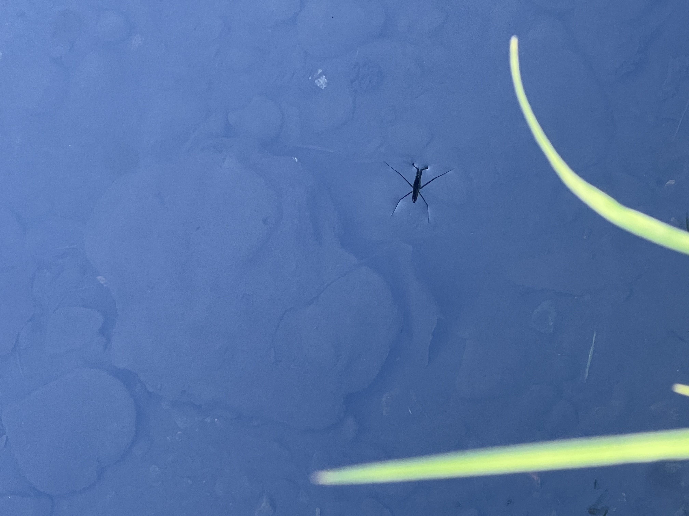
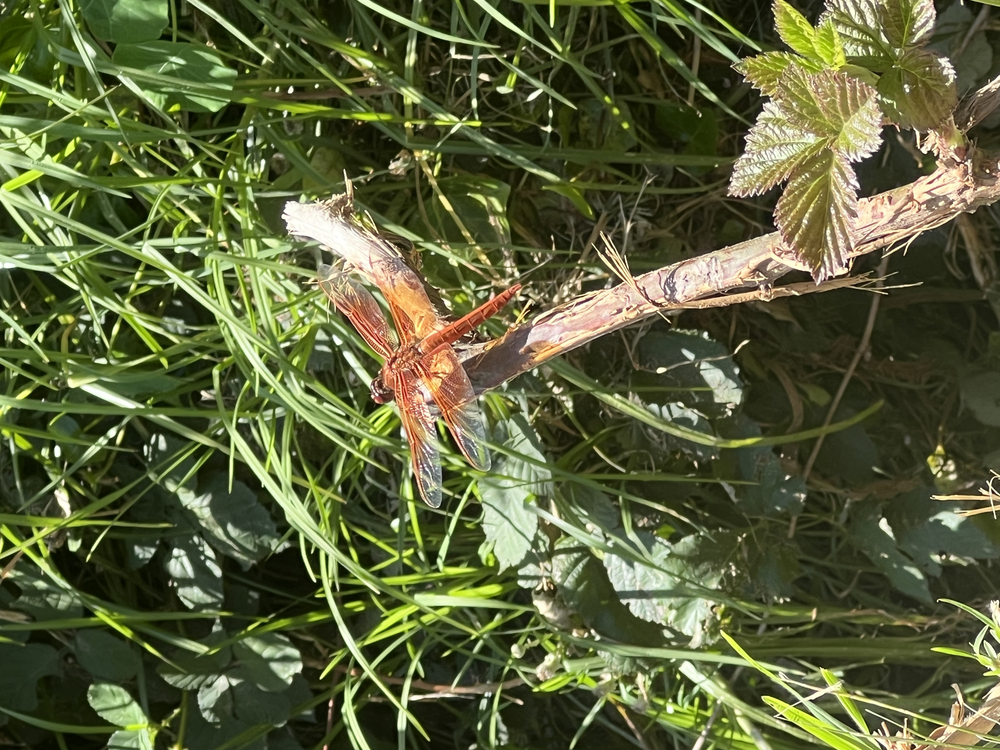
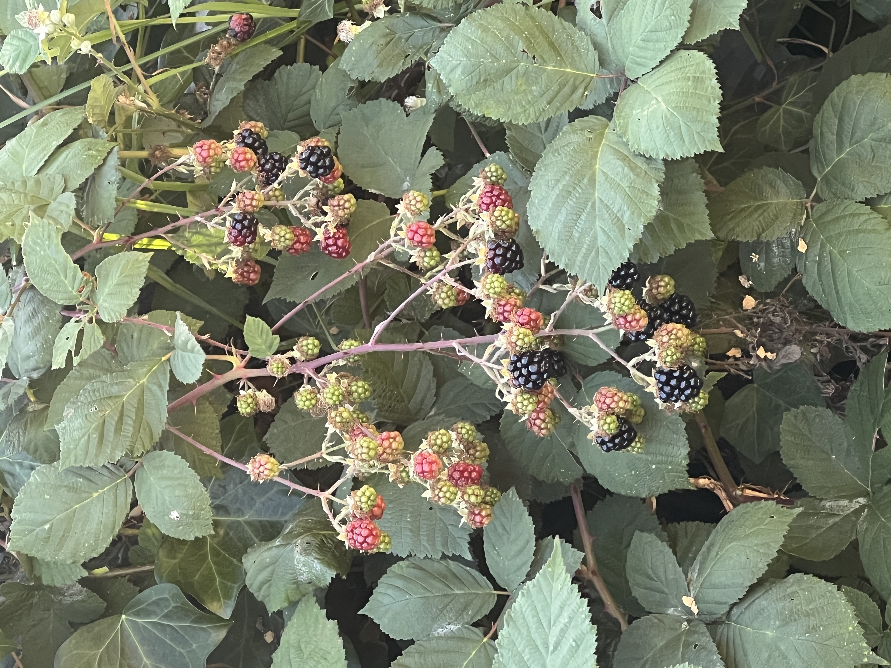
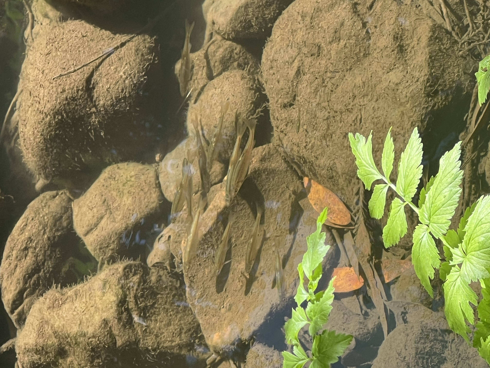
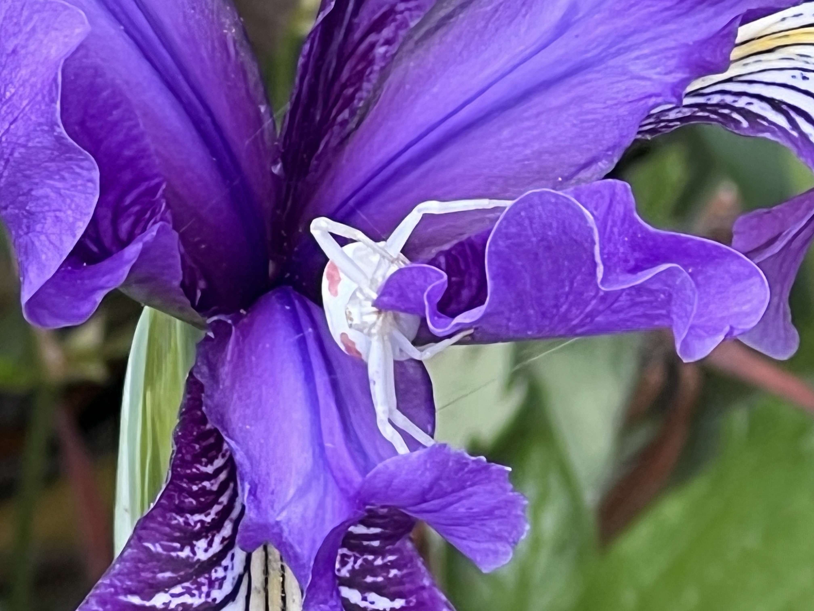
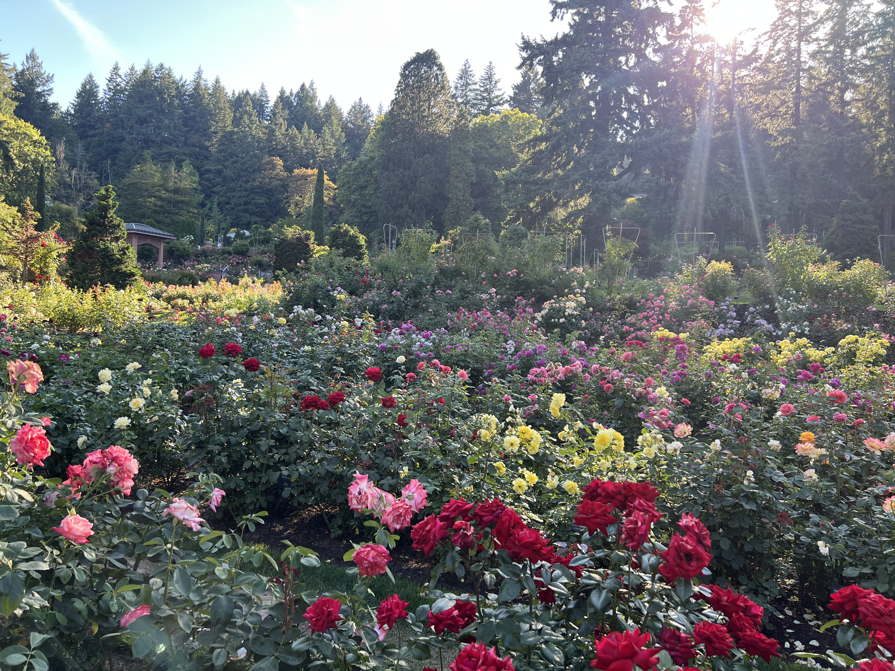
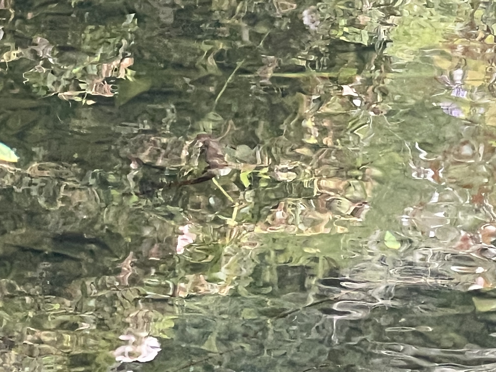
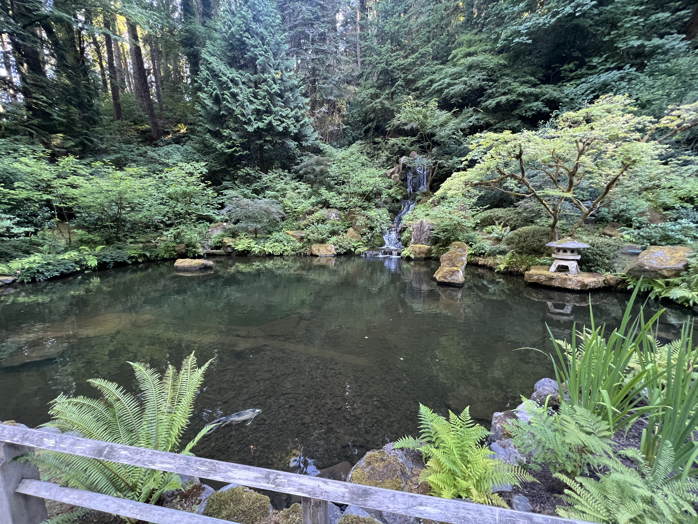
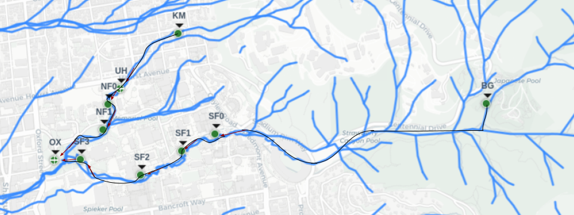
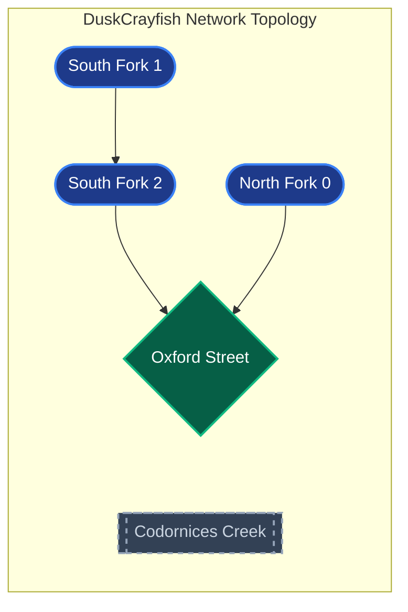

<div align="center">

<h1>StrawberryWatch</h1>

<p>A modular anomaly detection system for the Strawberry Creek urban watershed</p>

<p align="center">
  
</p>

<p><a href="https://github.com/DChristensen12/StrawberryWatch/actions/workflows/lint.yml"></a> <a href="https://github.com/astral-sh/ruff"></a> <a href="https://github.com/pre-commit/pre-commit"></a>  <a href="https://pytorch.org/"></a> <a href="LICENSE"></a></p>

</div>

This repository is the research and development counterpart to the production monitoring platform. It is where anomaly detection models are built, tested against historical events, and validated!


## The Creek

The creek is monitored at eleven locations: UC Botanical Gardens, Women's Faculty Club (south fork 0), Stephens Hall (south fork 1), Downstream of Sather Gate (south fork 2), Weil Hall (south fork 3), Kingman Hall Garden, University House, Giannini Hall (north fork 0), Wickson Footbridge (north fork 1, also sometimes labeled as scnf010), and Codornices Creek. The eleventh site, Codornices, is a separate watershed monitored as a standalone point.

### Sensors + Measured Metrics

Every site runs an [EnviroDIY Mayfly Data Logger](https://www.envirodiy.org/mayfly/),
sampling every 15 minutes. Which sensors are present at which site varies, and
that is recorded in the inventory config instead of being inferred from the data, so
it is able to tell when a sensor is down and when a sensor was never installed.

| Metric | Probe | Protocol |
|---|---|---|
| Conductivity, temperature, depth | METER HYDROS 21 CTD | SDI-12 |
| Dissolved oxygen | AtlasScientific DO | analog or I2C, depending on probe generation |
| Floating conductivity | AtlasScientific Mini Conductivity K 1.0 | I2C |
| pH | AtlasScientific pH | I2C |

Conductivity, temperature and depth come from one probe, so a site has all three
or none. The rest are installed separately.

Floating conductivity sits in a sealed float inside a perforated housing and
reads the top of the water column, which is what separates a surface
contaminant like oil from one that mixes through.

Three legacy Balance Hydrologics sites are read from a separate system and serve
only the past seven days.


## Models

<table align="center">
  <tr>
    <td align="center"><b>Dusk Crayfish</b></td>
    <td align="center"><b>Water Strider</b></td>
    <td align="center"><b>Flame Skimmer</b></td>
  </tr>
  <tr>
    <td align="center" width="33%">A graph neural network paired with an LSTM. It predicts what the creek as a whole should be reading next, and flags timesteps where the network differs from that.</td>
    <td align="center" width="33%">TBD</td>
    <td align="center" width="33%">A Bayesian neural network. It learns a distribution over its weights rather than fixed values, so every forecast carries a calibrated uncertainty estimate.</td>
  </tr>
  <tr>
    <td align="center"></td>
    <td align="center"></td>
    <td align="center"></td>
  </tr>
   <tr>
    <td align="center"><b>Berry Delight</b></td>
    <td align="center"><b>Cobble Shoal</td>
    <td align="center"><b>Crimson Parker</b></td>
  </tr>
  <tr>
    <td align="center" width="33%">Logistic Regression Model</td>
    <td align="center" width="33%">A graph neural network paired with an LSTM that scores each sensor separately rather than the network as a whole. It treats every sensor at every site as its own node, learns how quickly each reading goes stale, and combines several independent checks so it can name which sensor looks wrong and how confident it is.</td>
    <td align="center" width="33%">TBD</td>
  </tr>
  <tr>
    <td align="center"></td>
    <td align="center"></td>
    <td align="center"></td>
  </tr>
</table>

## Support Modules

Support modules attach to any model. They are not models themselves and have no
weights of their own. Some explain a detection after it happens while others cover something a model structurally cannot see (adds tests,
so switching one on makes the model slightly less sensitive elsewhere).

<table align="center">
  <tr>
    <td align="center"><b>Trial Bed</b></td>
    <td align="center"><b>Newtwork Run</b></td>
    <td align="center"><b>Settling Pool</b></td>
  </tr>
  <tr>
    <td align="center" width="33%">Identifies what kind of contamination a detection looks like. It reads the direction each measurement moved, matches that pattern against known signatures, and reports the likely cause alongside the readings behind it.</td>
    <td align="center" width="33%">Confirms a detection travelled the way water does. A spill reaches downstream sites after a delay set by the creek's flow and never crosses forks, while rain arrives everywhere at once; comparing timing across sites separates the two and flags anything water could not have carried.</td>
    <td align="center" width="33%">Screens incoming data before it gets passed into a model. Catches placeholder values passing as real readings, feeds silently mirroring another site, sensors re-zeroed between deployments, and gaps that were filled rather than measured, each one something a model would otherwise learn from.</td>
  </tr>
  <tr>
    <td align="center"></td>
    <td align="center"></td>
    <td align="center"></td>
  </tr>
</table>


## What the deployed Model does

The currently depoloyed model, Dusk Crayfish, learns the creek's normal behavior from sensor data and flags deviations that look like spills or contamination events, without being trained on labeled anomalies. It treats the creek as a connected graph of sensor sites and combines a graph neural network with an Long Short Term Memory architecture to reason about both where a sensor sits in the flow and how its readings change over time.

The map below shows these sensors on the actual creek, with each fork tracing the real water flow down to the Oxford Street confluence.

<p align="center">
  
</p>

<p align="center"><i>The physical sensor network along Strawberry Creek, overlaid on the creek's real flow. Both forks converge at the Oxford Street confluence. This is the full field deployment, not the modeled graph: four of these sites are modeled, north_fork_0, south_fork_1, south_fork_2, and Oxford.</i></p>

To see the entire creek in more detail, you can view the map on the Strawberry Creek website. The same network, expressed as the directed flow graph the system reasons over, looks like this.


<p align="center"><i>Full Graph Topology: Complete physical watershed sensor footprint of the Strawberry Creek monitoring network.</i></p>

The model is trained and validated on a four-node core of this network, the main flow path where conductivity data is reliable. That active subgraph is shown below, with the remaining sites slated to be brought in as their data ingestion is completed. The north path runs straight from north_fork_0 to Oxford because the footbridge node between them was retired; the water still flows that way, there is just no sensor reporting in between.


<p align="center"><i>Dusk Crayfish Active Graph Topology: the 4-node subnetwork the model actually trains and serves on.</i></p>

The system pulls sensor readings, merges in weather, learns what normal looks like across the whole network, and then scores new data by how badly the model fails to predict it. A large, sustained prediction error on conductivity that shows up across connected sites is the signature of a real event.

The model is unsupervised. It is trained only to predict the next reading from recent history. Anything it cannot predict well is, by definition, something it has not seen before, which is what an anomaly is.

## Setup

Clone the repository and create a virtual environment using Python 3.12, then install the package in editable mode.

```bash
python -m venv .venv
source .venv/bin/activate
pip install -e .
```

The editable install is not optional. Everything imports from the `strawberrywatch` package, so without it a fresh clone will fail on the first import. It also means the scripts and tests work from any directory rather than only from the repository root.

The system needs environment variables for data and weather access. Copy `.env.example` to `.env` in the repository root and fill in what applies to your setup.

### Layout and imports

All library code lives in one package, `strawberrywatch/`. Everything else stays at the repository root and is not part of the installable package.

```
strawberrywatch/        the importable package
  config.py             settings, loaded from settings.yaml next to it
  paths.py              locates data/ and checkpoints/ relative to the project root
  ingest/  preprocessing/  models/  training/  anomalies/  utils/
main.py                 pipeline entry point
scripts/                operational and verification scripts
assets/                 logos/, biota/ (creek life), diagrams/ (graphs and maps)
tests/  data/  checkpoints/  integrations/  notebooks/
```

Imports use the package path:

```python
from strawberrywatch.config import Config
from strawberrywatch.models.Dusk_Crayfish import DuskCrayfish
from strawberrywatch.anomalies.anomaly_detector import detect_anomalies
```

Trained weights and metadata live in `checkpoints/` at the repository root, renamed from `models/` so it no longer collides with `strawberrywatch.models`, which is code. Data and checkpoints deliberately sit outside the package so they are never bundled into a wheel.

`paths.py` finds them by checking `STRAWBERRYWATCH_ROOT` first, then walking up from the package looking for `pyproject.toml` or `.git`. If there is no project root it returns `None` and the function that needed a file raises an error naming both the environment variable and the explicit argument, rather than guessing at the current directory. Nothing resolves a path or creates a directory at import time, so `import strawberrywatch` works with no data present.

```
# Public API (the token field is optional; the API currently requires no auth)
SCMG_API_TOKEN=
SCMG_API_BASE_URL=https://www.strawberrycreek.org/api/creek-data/

# NWS weather station -- no API key required, but NWS requires a contact email
# in the User-Agent string
NWS_STATION_ID=LBNL1
NWS_USER_AGENT=SCMG-AnDeSys/1.0 (your.email@example.com)
USE_NWS_WEATHER=true

# MySQL -- only needed with --data-source sql
MYSQL_HOST=
MYSQL_DATABASE_USER=
MYSQL_DATABASE_PASSWORD=
MYSQL_DATABASE_NAME=
MYSQL_PORT=3306

# Email alerts -- only needed if you want spill notifications
ALERT_EMAIL_SENDER=your_email@gmail.com
ALERT_EMAIL_PASSWORD=your_app_password
ALERT_EMAIL_RECEIVER=who_to_notify@gmail.com
SMTP_SERVER=smtp.gmail.com
SMTP_PORT=587

# How many days of data to keep in the rolling local cache
ROLLING_WINDOW_DAYS=90
```

The MySQL variables are only needed if you run with `--data-source sql`. Weather from NWS and Open-Meteo needs no key, but the NWS user-agent string must include a contact email per NWS requirements.

One network note. The Open-Meteo historical archive must be reachable for long-window weather fetches. If your machine restricts outbound traffic, the host `archive-api.open-meteo.com` needs to be allowed, or the pipeline will fall back to running without weather features.

## Development

Install the dev dependencies and the git hooks:

    pip install -e ".[dev]"
    pre-commit install

Formatting and linting run on commit. To run them by hand:

    ruff format .
    ruff check .

## How to use Dusk Crayfish

The main entry point is `main.py`. It has three modes.

Once the package is installed with `pip install -e .`, these commands work from any directory, not just the repository root. Paths are resolved from the project root rather than the working directory.

**Train** builds a fresh model on thirty days of data, computes a detection threshold from a validation split, and saves the weights and metadata into `checkpoints/` at the repository root.

```bash
python main.py --mode train --data-source api
```

**Inference** loads the saved model, pulls a short recent window (two days), and reports any anomalies. It falls back to training if no saved model exists.

```bash
python main.py --mode inference --data-source api
```

**Update** retrains on a fresh thirty-day window while reusing the existing setup, for keeping the model current as new data arrives. This is the default mode when `--mode` is not specified.

```bash
python main.py --mode update --data-source api
```

The `--data-source` flag chooses between the public API, which provides the three core sensor features, and the production SQL database, which provides more. The `--model` flag selects the architecture, defaulting to the validated one.

```bash
python main.py --mode train --data-source sql --model dusk_crayfish
```

Adding `--visualize` after any run produces a static dashboard and an interactive plot of the scores, thresholds, and flagged events.

To start the continuous monitoring loop, run `scripts/run_live.py` directly. It blocks indefinitely, calling `main.py --mode inference` via subprocess every 15 minutes, and exits cleanly on Ctrl-C. It resolves `main.py` relative to its own location, so it can be launched from any directory.

```bash
python scripts/run_live.py
```

To validate the model against the labeled historical events, run the test suite. The `-s` flag shows the per-case diagnostic output, which is worth reading because each case prints its error curve and how many timesteps crossed the threshold.

```bash
pytest tests/test_anomaly_detection.py -v -s
```

---

## Thank you to our contributors!

<a href="https://github.com/DChristensen12/StrawberryWatch/graphs/contributors">
  
</a>

See [CONTRIBUTORS.md](CONTRIBUTORS.md) for everyone who has helped, including
those whose contributions do not appear in the commit history.

---

<p align="center">
  
</p>
